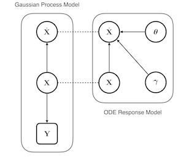

:orphan:

.. _tutorials-mlfm-ag:

Adaptive Gradient Matching Methods
==================================

These methods have been introduced in [1]_ to handle parameter inference in the very
general class of nonlinear ODE models

.. math::

   \dot{\mathbf{X}}(t) = f(\mathbf{X}; \boldsymbol{\theta}).

The idea is to combine both the explicit relationship given by the function $f$, and
a Gaussian process prior on the state variables. This leads to a pair of densities

.. math::

   p(\dot{\mathbf{X}}\mid \mathbf{X}) = \prod_{k=1}^{K}
   p(\dot{\mathbf{x}}_k \mid \mathbf{x}_k)

and

.. math::

   p(\dot{\mathbf{x}}_k \mid \mathbf{x}_k ) = \prod_{k=1}^{K}
   \mathcal{N}(\dot{\mathbf{x}}_k \mid \mathbf{f}_k, \gamma_k^2 \mathbf{I})

   **Figure**
   Conceptual diagram of the product of experts approximation. The
   ODE model and the GP prior are combined by identifying the variables
   connected with the \"- - - \" line by way of the product of experts assumption

For the MLFM AdapGrad model the likelihood of a set of state variables may be written

.. math::

   \begin{align}
   p(\mathbf{X} \mid \mathbf{g} ) \propto
   \prod_{k=1}^{K} \exp\bigg\{
   &-\frac{1}{2}
   (\mathbf{f}_k - \mathbf{m}_{\dot{x}_k|x_k})^{\top}
   (\mathbf{C}_{\dot{x}_k|\dot{x}} + \gamma I)^{-1}
   (\mathbf{f}_k - \mathbf{m}_{\dot{x}_k|x_k}) \\
   &-\frac{1}{2}\mathbf{x}_k^{\top}\mathbf{C}_{x_k}\mathbf{x}
   \bigg\},
   \end{align}

where :math:`\mathbf{f}_k` is the vector of components of the evolution equation,
the entries of which are given by

.. math::

   f_{kn} = 
   \sum_{r=0}^{R} g_{rn} \sum_{d=1}^D \beta_{rd}
   \sum_{j=1}^{K} L_{dkj} x_{jn},

One interesting point from the perspective of identifiability of models of these
types is that the likelihood-term will remain invariant under choices of
:math:`\mathbf{g}, \boldsymbol{\beta}` such that :math:`\mathbf{f}_k` remains
invariant.

All of the adative gradient matching methods proceed from this conditional density

.. _mlfm-ag-tutorials-partab:

Model Parameters
~~~~~~~~~~~~~~~~

The following table gives the complete collection of variables that appear in the adaptive
gradient matching method for the MLFM, along with a brief description of this variables,
how this variable is referred to when using the package, along with transformation that i
s applied to this variable to give it a more natural support.

.. table:: Parameters of the MLFM-AG model
   :widths: auto

   +-----------------------------+-----------------------------+------------------+---------------------+---------------+ 
   | Parameter name              | Description                 | Variable name    | Transform           | Is Fixed      |
   +-----------------------------+-----------------------------+------------------+---------------------+---------------+
   | :math:`\mathbf{g}`          | The (vectorised) latent GPs | :code:`g`        | :math:`\mathrm{Id}` | :code:`False` |
   +-----------------------------+-----------------------------+------------------+---------------------+---------------+
   | :math:`\boldsymbol{\psi}`   | latent GP hyperparameters   | :code:`logpsi`   | :math:`\log`        | :code:`False` |
   +-----------------------------+-----------------------------+------------------+---------------------+---------------+
   | :math:`\boldsymbol{\beta}`  | Basis coefficients          | :code:`beta`     | :math:`\mathrm{Id}` | :code:`False` |
   +-----------------------------+-----------------------------+------------------+---------------------+---------------+
   | :math:`\boldsymbol{\tau}`   | Observation precisions      | :code:`logtau`   | :math:`\log`        | :code:`False` |
   +-----------------------------+-----------------------------+------------------+---------------------+---------------+
   | :math:`\boldsymbol{\gamma}` | ODE model regularisation    | :code:`loggamma` | :math:`\log`        | :code:`True`  |
   +-----------------------------+-----------------------------+------------------+---------------------+---------------+

MAP Estimation
--------------

The following list of notebooks give an introduction to fitting these models using
the adaptive gradient matching approximation, as well as a discussion of some of
the more general features of the MLFM model

References
----------

.. [1] Calderhead, Ben and Girolami, Mark and Neil D. Lawrence, "Accelerating
   Bayesian Inference over Nonlinear Differential Equations with Gaussian
   Processess", NIPS, 2009

.. raw:: html

    

.. only:: html

    .. figure:: /tutorials/mlfm_adapgrad_tutorials/images/thumb/sphx_glr_plot_mlfmag_thumb.png

        :ref:`sphx_glr_tutorials_mlfm_adapgrad_tutorials_plot_mlfmag.py`

.. raw:: html

    

.. toctree::
   :hidden:

   /tutorials/mlfm_adapgrad_tutorials/plot_mlfmag

.. raw:: html

    

.. only:: html

    .. figure:: /tutorials/mlfm_adapgrad_tutorials/images/thumb/sphx_glr_plot_mlfmaggibbs_thumb.png

        :ref:`sphx_glr_tutorials_mlfm_adapgrad_tutorials_plot_mlfmaggibbs.py`

.. raw:: html

    

.. toctree::
   :hidden:

   /tutorials/mlfm_adapgrad_tutorials/plot_mlfmaggibbs

.. raw:: html

    

.. only:: html

    .. figure:: /tutorials/mlfm_adapgrad_tutorials/images/thumb/sphx_glr_plot_mlfmagvar_thumb.png

        :ref:`sphx_glr_tutorials_mlfm_adapgrad_tutorials_plot_mlfmagvar.py`

.. raw:: html

    

.. toctree::
   :hidden:

   /tutorials/mlfm_adapgrad_tutorials/plot_mlfmagvar
.. raw:: html

    

.. only :: html

 .. container:: sphx-glr-footer
    :class: sphx-glr-footer-gallery

  .. container:: sphx-glr-download

    :download:`Download all examples in Python source code: mlfm_adapgrad_tutorials_python.zip <//Users/danieltait/Desktop/pydygp/doc/source/tutorials/mlfm_adapgrad_tutorials/mlfm_adapgrad_tutorials_python.zip>`

  .. container:: sphx-glr-download

    :download:`Download all examples in Jupyter notebooks: mlfm_adapgrad_tutorials_jupyter.zip <//Users/danieltait/Desktop/pydygp/doc/source/tutorials/mlfm_adapgrad_tutorials/mlfm_adapgrad_tutorials_jupyter.zip>`

.. only:: html

 .. rst-class:: sphx-glr-signature

    `Gallery generated by Sphinx-Gallery <https://sphinx-gallery.readthedocs.io>`_
