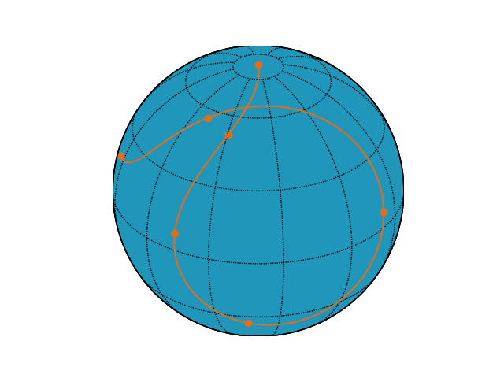

.. _mlfm

==================================
Multiplicative Latent Force Models
==================================

.. currentmodule:: pydygp.linlatentforcemodels

Simulating the MLFM
===================

Model Setup
-----------

We consider an example on the sphere and so we first create a set of `infinitesimal rotation <https://en.wikipedia.org/wiki/Rotation_group_SO(3)#Lie_algebra>`_ matrices, by choosing the evolution equation to be linear combinations of these matrices we will ensure that the trajectories of our model evolve on the surface of a sphere with radius determined by the initial conditions. 

   >>> import numpy as np
   >>> from pydygp.gaussianprocesses import GaussianProcess
   >>> from pydygp.linlatentforcemodels import MLFM
   >>> # make the infinitesimal rotation matrices
   >>> Lx = np.array([[0., 0., 0.], [0., 0.,-1.], [0., 1., 0.]])
   >>> Ly = np.array([[0., 0.,-1.], [0., 0., 0.], [1., 0., 0.]])   
   >>> Lz = np.array([[0.,-1., 0.], [1., 0., 0.], [0., 0., 0.]])

If we now consider the model with two independent latent forces defined by

   .. math::

      \dot{\mathbf{x}}(t) = \left(\mathbf{L}_x + g_1(t)\cdot \mathbf{L}_y + g_2(t)\cdot\mathbf{L}_z\right)\mathbf{x}(t)

then we can make this model by passing the list of the structure matrices to the :class:`pydygp.linlatentforcemodels.MLFM` object as a list such that :code:`struct_mats[0]` corresponds to the constant term and :code:`struct_mats[i]` is the coefficient matrix of :math:`g_i(t)`

   >>> struct_mats = [Lx, Ly, Lz]
   >>> mlfm = MLFM(struct_mats)

Now we need to create the latent forces using :class:`pydygp.gaussianprocesses.GaussianProcess`

   >>> # Create two GPs with square exponential kernels
   >>> g_gps = [GaussianProcess('sqexp', kpar=[1., 1.]) for r in range(2)]
   
We now have the main objects required to simulate the model but the simulation process itself is deserving of some additional comments.

Simulation with :class:`odeint`
-------------------------------

Simulation is done by passing the Gaussian processes and then simulating a set of outputs from them at a suitably high sampling density, where suitable will depend on the kernel parameters and the time span, so that we can treat the discrete samples of the Gaussian process as good approximations to the continuous functions. The simulated outputs are then converted into simple interpolating functions which can then be passed to the :class:`odeint` solver in scipy. The interpolating step is necessary because the :class:`odeint` method contain adaptive steps and therefore evaluate the evolution equation at additional time points to those supplied as arguments to the solver, it would of course be possible to use the :func:`\pred()` method the Gaussian process itself, but this is inefficient for many point wise evaluations of the function and it is much cheaper to use a simple linear interpolant between points and the difference will be neglible so long as the set of points over which the GP is simulated it suitable dense. Of course this step would be unnecessary if we were to write our own solver, but wherever possible we would like to take advantage of existing libraries.

+-----------+------------------------------------------+
| tt        | time vector of simulated outputs         |
+-----------+------------------------------------------+
| tt_dense  | time points at which the ode is solved   |
+-----------+------------------------------------------+
| tt_gp_sim | time points at which the gp is simulated |
+-----------+------------------------------------------+

Simulation
----------
We are now ready to simulate the model so lets do so

   >>> tt = np.linspace(0., 4, 7)
   >>> # dense set of times for simulating the trajectory
   >>> tt_d = np.linspace(0., 4, 100)
   >>> # set of times for simulating the latent force
   >>> tt_gp_sim = np.linspace(tt[0], tt[-1], 25)
   >>> # start at the North pole
   >>> x0 = [0., 0., 1.]
   >>> # returns y(tt), y(tt_dense), np.column_stack([g_1(tt_dense), g_2(tt_dense)])
   >>> y, y_dense, g, _ = mlfm.sim(x0, tt, gps=g_gps, tt_dense=tt_d, tt_gp_sim=tt_gp_sim, return_gp=True)

An example trajectory is displayed below

